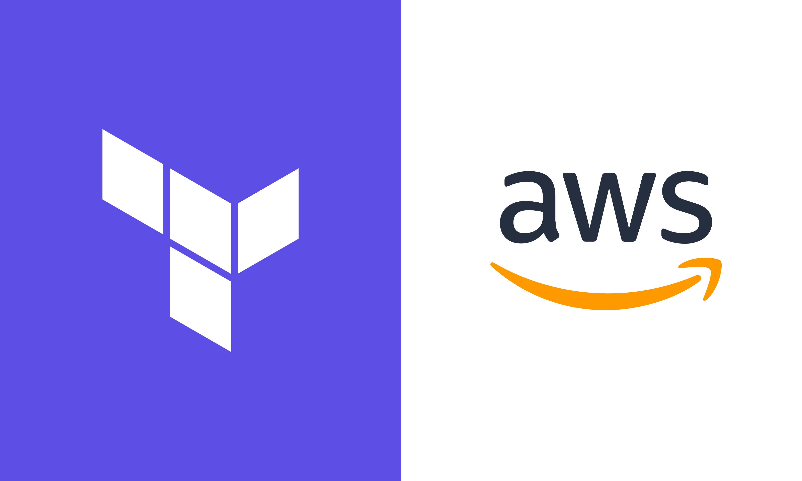

<!-- https://stackedit.io/app# -->
<!-- PROJECT LOGO -->
<br />
<div align="center" id="readme-top">
  <a href="https://gitlab.com/it-factory-thomas-more/cloud-engineering/23-24/iac-team-5/aws-iac-challenge-team-5">
    
  </a>

  <h3 align="center">IaC challenge - Team 5</h3>

  <p align="center">
    <br />
    <a href="https://gitlab.com/it-factory-thomas-more/cloud-engineering/23-24/iac-team-5/aws-iac-challenge-team-5"><strong>Bekijk de bestanden »</strong></a>
    <br />
    <br />
    <a href="https://gitlab.com/it-factory-thomas-more/cloud-engineering/23-24/iac-team-5/aws-iac-challenge-team-5/-/tree/production">Production branch</a>
    ·
    <a href="https://gitlab.com/it-factory-thomas-more/cloud-engineering/23-24/iac-team-5/aws-iac-challenge-team-5/-/tree/testing">Testing branch</a>
  </p>
</div>

<!-- Inhoudstafel -->
<details>
  <summary>Inhoudstafel</summary>
  <ul>
    <li>
      <a href="#gebouwd-met">Gebouwd met</a>
    </li>
    <li>
      <a href="#over-dit-project">Over dit project</a>
      <ul>
        <li>
          <a href="#inleiding">Inleiding</a>
        </li>
        <li>
          <a href="#samenvatting-realistaties">Samenvatting realisaties</a>
        </li>
      </ul>
    </li>
    <li>
      <a href="#boockstack">Boockstack</a>
    </li>
    <li>
      <a href="#schema">Schema</a>
    </li>
    <li>
      <a href="#pipeline">Pipeline</a>
      <ul>
        <li>
          <a href="#terraform-helper-script">Terraform helper script</a>
        </li>
      </ul>
    </li>
    <li>
      <a href="#discord-meldingen">Discord meldingen</a>
    </li>
    <li>
      <a href="#dockerfile-voor-bookstack">Dockerfile voor bookstack</a>
    </li>
    <li>
      <a href="#testing">Testing</a>
    </li>
    <li>
      <a href="#besluit">Besluit</a>
    </li>
  </ul>
</details>


## Gebouwd met :
[![aws][aws-shield]][aws-url]
[![terraform][terraform-shield]][terraform-url]
[![gitlab][gitlab-shield]][gitlab-url]
[![discord][discord-shield]][discord-url]

<!-- Over dit project -->
## Over dit project
### Inleiding
Wij zijn team 5 voor de IaC challenge en onze opdracht is om met Gitlab CI/CD een webapplicatie op te zetten die bestaat uit een website als frontend en een database als backend. De applicatie die wij hiervoor hebben gekozen is **BookStack**. Dit allemaal moet gebeuren in de cloud omgeving van AWS. De bedoeling is om "Infrastructure as Code" te gebruiken om dit allemaal op te zetten, onze infrastructuur wordt opgezet doormiddel van terraform.<br>

### Samenvatting realisaties
Hier een korte samenvatting van alles wat we gerealiseerd hebben:

#### Basis
- Infrastructuur voor onze Bookstack applicatie volledig automatisch
- Discord notificaties die een fail/success van elke stage sturen
- Omgeving kan gedestroyed worden met 1 klik
- Omgeving kan opnieuw opgebouwd worden met gebruik van de pipeline
- Data blijft persistent
- Security implementaties zoals bijvoorbeeld:
  - Secure passwords (geen plaintext, worden veilig doorgegeven via Gitlab variabelen)
  - Security groups met least privilege
  - Private en public subnets

#### Extra
- SAST vulnerability testing op onze terraform code
- Load balancing
- Horizontal scaling
- Multi-AZ setup
- Gebruik van Secret Manager
- Branching strategy die eerst naar test branch deployed en dan naar production branch

## Bookstack
Onze gekozen webapplicatie is zoals eerder vermeldt dus Bookstack. Bookstack is een soort van wikipedia, maar dan voor boeken. Je kan er boeken in toevoegen, pagina's in boeken toevoegen, deze sorteren in "shelves", enzovoort.
Hieronder een voorproefje van hoe de Bookstack applicatie eruitziet:<br>


### Hoe onze oplossing gebruiken?
Om onze oplossing zelf te gebruiken dienen de volgende stappen uitgevoerd te worden.

#### Gitlab variabelen in de CI/CD instellingen aanpassen
Het is natuurlijk cruciaal dat je de credentials van je learner lab dat draaiende is in de Gitlab CI/CD instellingen meegeeft, zodat deze in de pipeline kunnen gebruikt worden. Deze vindt je in je Learner Lab bij AWS Details:<br>
  

Indien je zelf andere variabelen wilt aanpassen kan dit ook, zodat je zelf bijvoorbeeld een database naam kunt kiezen. Hieronder een screenshot van deze variabelen: <br>
  

#### Run de pipeline of push code
De volgende stap is gewoon zelf code pushen naar de repo, zodat de pipeline automatisch start, of gewoon de vorige pipeline opnieuw runnen.
De pipeline gaat door alle verschillende stappen, en wanneer deze klaar is draait de applicatie op het adres van de loadbalancer.
Dit adres kan je vinden in de output van de Apply stage:<br>
  

Wanneer we naar dit adres surfen, komen we op de applicatie uit!<br>


## Schema
Ons schema ziet er als volgt uit:<br>

<br><br>
Zoals je in het schema kunt zien hebben we een VPC waar 4 subnets in zitten, 2 public subnets voor de frontend en 2 private subnets voor de database waar gegevens in staan. De database zetten we in een private subnet omdat dit een best practice is en zodat andere personen niet zomaar alle gegevens in de database kunnen zien.<br><br>
De image van BookStack hebben we eerst lokaal gebouwd en aangepast zodat deze met de database kan verbinden vervolgens er later gegevens van kan uithalen en gegevens in kan opslaan. Daarna wordt deze via de pipeline naar de Container Registry van Gitlab gepushed. Dit is een opslag plaats voor images. Deze image wordt dan via een container definition gepulled naar de ECS om zo een container op te zetten met de web applicatie in. Deze containers zijn enkel toegankelijk via de loadbalancer op poort 80 voor HTTP. Voor de egress kan het container verkeer van elke poort naar alle ip addressen antwoorden.
<br><br>
Als launch type voor de ECS service hebben we gekozen voor Fargate, omdat dit een serverless manier is om een kleine applicatie te runnen en het is een goedkopere optie als een EC2.
<br>
Deze containers worden geloadbalanced door een loadbalancer die wij gekoppeld hebben aan de public subnets zodat de containers een IP krijgen uit de range die wij meegegeven hebben. Aan de loadbalancer hebben we een listener toegevoegd zodat als de loadbalancer aangesproken wordt voor een verzoek naar poort 80 dat deze wordt geforward naar een container met de web application. Deze loadbalancer is toegankelijk op poort 80 vanaf het internet.
De loadbalancer balanced statefull, aangezien Bookstack een statefull applicatie is.
<br>


## Pipeline 

De opstelling van de GitLab pipeline staat in het '.gitlab-ci.yml' bestand. In dit bestand geef je de verschillende stages aan die je wilt uitvoeren. In onze pipeline hebben we 6 stages: package, validate, test, plan, apply en destroy. <br>
 <br>

### Package
In de package stage wordt de Docker image van de bookstack app gebuild en naar de GitLab Container Registry gepushed. <br>

### Validate
In de validate stage wordt de terraform code gevalideerd. Dit gebeurt door de terraform validate commando uit te voeren. Dit commando staat in een helper script om de pipeline zelf wat overzichtelijker te houden. <br>

### Test
Voor we de applicatie gaan deployen, willen we deze eerst testen voor security problemen. Dit doen we door middel van een SAST (Static Application Security Testing) tool. Deze tool gaat de terraform code scannen op mogelijke vulnerabilities. <br>

### Plan
In de plan stage wordt de terraform code gepland. Dit gaat de terraform nakijken om te zien of de opstelling mogelijk is. Door de plan stage te runnen, krijg je een overzicht van wat er allemaal gaat gebeuren als je de code gaat uitvoeren, zonder deze effectief uit te voeren. Ook dit commando staat in het helper script om de pipeline overzichtelijk te houden. <br>

### Apply
In de apply stage wordt de terraform code uitgevoerd. Dit gaat de infrastructuur opzetten in AWS. Ook dit commando staat in het helper script. <br>

### Destroy
Als de AWS infrastructuur niet meer nodig is, kan je deze afbreken door de destroy stage te runnen. Deze staat ingesteld om manueel getriggerd te worden, want de infrastructuur opbouwen om hem vervolgens meteen af te breken is geen slim plan. De destoy stap kan gestart worden vanuit het GitLab pipeline tabblad.
 <br>


## Terraform helper script
In de pipeline maken we gebruik van een helper script om de pipeline overzichtelijk te houden. Dit script bevat de terraform commando's die we nodig hebben om de pipeline te runnen en de nodige parameters. Elke stap heeft zijn eigen waarde die meegegeven wordt aan het script en gebruikt wordt in de 'switch' statement om te kijken welk het nodige commando is. <br>

### Script voorbeeld
 <br>
Zoals hierboven te zien is, is het script 1 terraform commando en de nodige parameters. Door dit in een appart script te doen kunnen de parameters ook netjes onder elkaar worden gezet waardoor ze leesbaar zijn. <br>

### Script gebruik


In de pipeline wordt het script gebruikt door de stage achter de call naar het script te zetten. <br>

## Discord meldingen

De meeste stages in onze pipeline zijn ook ontworpen om meldingen naar een kanaal in ons team hun discord channel te posten. Dit doen we door gebruik te maken van de discord webhook en weer een appart script. <br>

### Discord melding code
```bash
- sh ../terraform_command.sh apply || { sh ../notifications.sh apply failure $discord_webhook_url && exit 1;}
- sh ../notifications.sh apply success $discord_webhook_url
```
Op deze manier wordt het script om een melding te sturen getriggerd na het uitvoeren van een stage.

```bash
(curl --fail --progress-bar -A "GitLabCI-Webhook" -H Content-Type:application/json -d "$WEBHOOK_DATA" "$WEBHOOK_URL" \
&& echo -e "\\n[Webhook]: Successfully sent the webhook.") || echo -e "\\n[Webhook]: Unable to send webhook."
```
Het script zelf om de melding te sturen bestaat vooral uit opmaak, en eidigt met een curl commando om de melding te sturen. Als het sturen van het commando op een manier toch niet zou lukken wordt er een error in de job console geprint. <br>


### Discord melding succes


Deze melding heeft een groene rand om snel aan te tonen dat het een succesvolle stap is in de pipeline. Als de titel 'Pipeline #...' wordt aangeklikt kom je op die specifieke pipeline pagina terecht. Vervolgens wordt er gezegd wie de commit & push heeft gedaan. Er worden nog 2 links gegeven naar de commit pagina en naar de branch waar de push naar gebeurt. Als laatste kan je ook op de 'job' stage klikken om meteen naar de job pagina te gaan. <br>

### Discord melding failure


Deze melding heeft een rode rand om snel aan te tonen dat het een gefaalde stap is in de pipeline. De opbouw van deze melding is exact hetzelfde als die van een succes melding. Het handige aan deze melding is de link naar de gefaalde job, om zo meteen op de console output terecht te komen om de volledige error te bekijken. <br>

### Dockerfile voor Bookstack
In onze Dockerfile maken we een image aan waar bookstack in gebuilt word.
De image gebruikt een basis php:apache image waar bookstack op de apache server gerund wordt.
we gebruiken ENV variabelen om de data die secret moet blijven niet te tonen in open code.
Bookstack wordt lokaal gebouwd door gebruik te maken van de application folder waar de officiële bookstack repository inzit.
De image die hier uitkomt wordt gerund op poort 80 en gerund in Apache deze wordt aangeleverd en gerund als container in ECS en zorgt ook voor een connectie met de database.


### Testing
Als infrastructure testing hebben we gekozen voor een SAST oplossing, die de vulnerabilities in onze terraform code test. Deze geeft de vulnerabilities puur mee als info, en geeft advies over hoe je deze kan oplossen. De output kan gevonden worden in een extra tabje dat wordt aangemaakt in de pipeline, zoals hieronder omkadert in het blauw.
Een voorbeeld van output van deze SAST hieronder:<br>


### Besluit

Kortom, het werken aan dit project is voor ons een leerzame ervaring geweest. We hebben met succes een uitgebreide oplossing geïmplementeerd voor het implementeren van een applicatie gemaakt door developers, doormiddel van Infrastructure as Code (IaC) principes. 

Door gebruik van Terraform te maken konden we het beheer van AWS-resources automatiseren, waarmee we onze vaardigheid in cloudinfrastructuur en automatiseringsconcepten demonstreerden.

Door GitLab CI/CD te implementeren in onze deployment pipeline konden we de fasen van de verschillende stappen van softwareontwikkeling automatiseren.

We hebben Discord-meldingen geïntegreerd in onze pipeline voor realtime updates over elke fase. Dit verbeterde ons monitoring- en probleemoplossingsproces, waardoor problemen snel konden worden opgespoord en opgelost. 

We legden ook de nadruk op beveiliging in ons project, beveiligingsgroepen met zo min mogelijk privileges en private en publieke subnetten. We gebruikten een SAST-tool voor het testen van kwetsbaarheden in onze Terraform-code, wat onze toewijding aan het handhaven van hoge beveiligingsstandaarden versterkte.

Over het algemeen was dit project een leerrijke ervaring die ons in staat stelde om onze kennis en vaardigheden in de praktijk te brengen. Het heeft niet alleen onze vaardigheid in IaC-principes, cloud computing, CI/CD-pipelines, containerisatie en beveiligingspraktijken versterkt, maar ook onze probleemoplossende en teamvaardigheden verbeterd. We zijn trots op wat we hebben bereikt en kijken ernaar uit om onze nieuwe skills toe te passen op toekomstige projecten.

<!-- Markdown Shields and URL's -->
[aws-shield]: https://img.shields.io/badge/Amazon_AWS-FF9900?style=for-the-badge&logo=amazonaws&logoColor=white
[aws-url]: https://aws.amazon.com/
[terraform-shield]: https://img.shields.io/badge/terraform-%235835CC.svg?style=for-the-badge&logo=terraform&logoColor=white
[terraform-url]: https://terraform.io/
[gitlab-shield]: https://img.shields.io/badge/GitLab-FFA116?style=for-the-badge&logo=gitlab&logoColor=white
[gitlab-url]: https://gitlab.com/
[discord-shield]: https://img.shields.io/badge/Discord-7289DA?style=for-the-badge&logo=discord&logoColor=white
[discord-url]: https://discord.com/